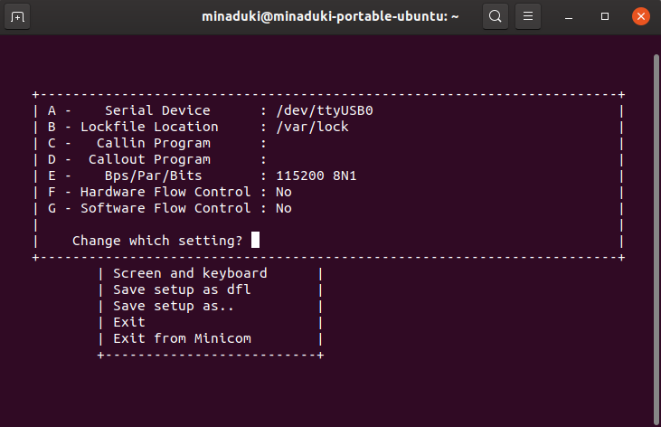

# My migration

## Step 1: Install the cross compilers
First mission is to install the gcc for arm linux to ensure that we can compile the kernel.     
As using Ubuntu distribution of Linux, use `apt` to install `gcc-arm-linux-gnueabihf` and the libraries used.     
```
sudo apt install gcc-arm-linux-gnueabihf
```
After finished installing, compile a simple "Hello world" program to see if the compiler is working properly.     
```
arm-linux-gnueabigf-gcc -o helloarm helloworld.c
```
Use `file` to see the properties of the output file.
> helloarm: ELF 32-bit LSB pie executable, ARM, EABI5 version 1 (SYSV), dynamically linked, interpreter /lib/ld-linux-armhf.so.3, BuildID[sha1]=8e92a4ef2b70e3db73ce9fe6a740a9025be3fdfc, for GNU/Linux 3.2.0, not stripped


## Step 2: Configure the Makefile of the kernel
Apply the defualt configure file for BeagleBone.    
```
make bb.org_defconfig ARCH=arm
```
Then use `make menuconfig ARCH=arm` to manage the modules.
1. In `Device Drivers`, enter the entry of `Block devices` and enable `RAM block device support`.
2. In `File systems`, enable support for `Network File Systems`.
3. Save the new configuration as `.config`.

## Step 3: Compile the kernel
```
make ARCH=arm CROSS_COMPILE=<Your own cross compiler prefix> -j8
## -j8 means use 8 threads to compile
```
In ths case, my Cross compiler prefix is set as `arm-linux-gnueabihf-`.       
The image file output is located at `./arch/arm/boot/`.    
The Device tree binary file output is located at `./arch/arm/boot/dts/`.

## Step 4: Configure minicom for serial communication
**Remeber to configure as superuser**  
For the first time running minicom, use command `minicom -s` to configure.    
1. Enter `serial port setup`.
2. Set `/dev/ttyUSB0` as the Serial Device.
3. Set Bps/Par/Bits to be `115200 8N1`.
4. Disable all Flow Controls.    
    
After finished, save the setup as defualt and run minicom.

## Step 5: Start the tftp service on PC.
1. Use `apt` to install package `tftp-hpa` and `tftpd-hpa`. 
2. Edit `/etc/hosts.allow` and add:
```
tftpd:ALL
in.tftpd:ALL
```
3. (Optional) (For Manjaro) Edit `/etc/conf.d/tftpd` to modify the default workspace.
3. (Optional) (For Ubuntu) Edit `/etc/default/tftpd` to modify the default workspace.
4. (Optional) Use `chmod` to edit the permissions of the workspace.
5. Start the service.
```
systemctl start tftpd.socket tftpd.service
systemctl enable tftpd.socket
```

## Step 6: Try to boot with U-boot using the kernel image
Wait for the device to boot into U-boot and use the following script to boot.
```
set ipaddr 192.168.208.121 # IP addr of BeagleBone
set serverip 192.168.208.21 # IP addr of PC

tftp 0x82000000 zImage # image file
tftp 0x88080000 ramdisk_img.gz # ramdisk
tftp 0x88000000 am335x-boneblack.dtb # device tree

set ramdisk root=/dev/ram rw initrd=0x88080000
set bootargs console=ttyO0,115200 $ramdisk
bootz 0x82000000 0x88080000: <size of ramdisk> 0x88000000
```

## Step 7: Start the NFS service on PC.
1. Use `apt` to install `nfs-kernel-server`.
2. Edit the file `/etc/exports` to configure the service.
3. Use `systemctl` to start and enable the service.