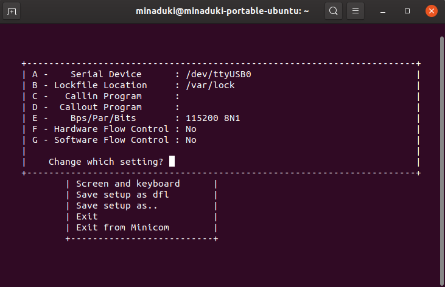
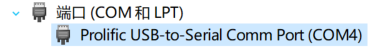
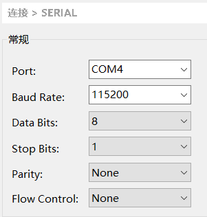

# 数字系统II 实验 报告一
Copyright (c) 2019 Minaduki Shigure.   
南京大学 电子科学与工程学院 吴康正 171180571   
项目repo地址：https://git.nju.edu.cn/Minaduki/beaglebone_proj

## 实验目的
1. 使用Minicom软件实现对串口的监控。
2. 通过tftp服务实现内核与根文件系统镜像的加载。
3. 使用U-boot设置Linux系统的启动参数。
4. 启动目标系统的Linux，完成初始化设置。
5. 编写目标系统的应用程序，通过交叉编译与NFS挂载实现在目标系统上的运行。
6. 使用Busybox创建根文件系统，并通过不同方式引导启动。

## 实验环境
### 1. 硬件环境
实验使用了TI的BeagleBone Black开发板作为实验环境，其参数如下：
* 处理器：基于ARM Cortex-A8架构的TI AM3359 Sitara @ 1GHz
* 内存：板载512MiB DDR3
* 存储：板载4GiB 8-bit eMMC闪存
* 拓展存储：支持micro SD存储卡
* 网络界面：RJ-45接口百兆以太网
* 数字多媒体输出：micro HDMI接口
* 拓展接口：UART、GPIO、SPI、I2C等
### 2. 软件环境
* 上位机：使用Ubuntu 19.10系统的x86 PC
* Linux源码：[版本4.4.155]("https://git.nju.edu.cn/Minaduki/linux")
* Busybox源码：[版本1.30.1]("https://git.nju.edu.cn/Minaduki/beaglebone_proj/tree/master/busybox-1.30.1")
* 编译器：The GNU Compiler Collection 9.2.1
* bootloader：U-boot
### 3. 网络环境
* 网关：192.168.208.254
* 上位机：192.168.208.35
* 开发板：192.168.208.121

## 实验原理
> 关于实验原理：   
具体的实验原理，如串口的参数，bootloader的作用、工作方式，内核的加载和运行，Makefile的配置和解析方式，各种文件系统的原理和特点，根文件系统的作用等等在实验指导书中都有所提及，在这里不再重复叙述。这里仅进行一些补充说明。

### 1. 关于Busybox
在利用busybox生成文件系统后，可以看到可执行文件目录下的文件结构如下：
```
(部分)
drwxr-xr-x  2 minaduki minaduki    4096 11月 12 15:04  ./
drwxr-xr-x 10 minaduki minaduki    4096 11月 12 15:50  ../
lrwxrwxrwx  1 minaduki minaduki       7 11月 12 15:11 '[' -> busybox*
lrwxrwxrwx  1 minaduki minaduki       7 11月 12 15:11 '[[' -> busybox*
lrwxrwxrwx  1 minaduki minaduki       7 11月 12 15:11  arch -> busybox*
lrwxrwxrwx  1 minaduki minaduki       7 11月 12 15:11  ash -> busybox*
lrwxrwxrwx  1 minaduki minaduki       7 11月 12 15:11  base64 -> busybox*
-rwxr-xr-x  1 minaduki minaduki 1472240 11月 12 15:04  busybox*
lrwxrwxrwx  1 minaduki minaduki       7 11月 12 15:11  cat -> busybox*
```
可见事实上所有的可执行命令都是指向busybox文件的软链接，在实际执行中，busybox通过判断终端输入的第一个参数即`argv[0]`来决定实际执行的操作。

## 实验流程
### 1. 准备工作
#### 1.1 安装交叉编译工具链
对于上位机使用的Ubuntu系统，可以直接通过包管理`apt`安装交叉编译工具链，工具会被自动安装在`/usr/bin`目录下，此目录默认在系统的PATH中，因此无需进一步操作。   
对于ARM Cortex-A8架构的处理器，其支持硬件层面的浮点运算，对应的交叉编译器包名为`gcc-arm-linux-gnueabihf`，对于一些较为简单的系统（如树莓派Zero，其处理器为ARM Cortex-A6L)，其浮点运算为软件实现，对应的包名则为`gcc-arm-linux-gnueabi`。
> 尾部多出的hf即为Hardware Floatpoint的意思。

在终端中输入如下命令，完成交叉编译工具链的安装：
```
$ sudo apt install build-essentials gcc-arm-linux-gnueabihf
```
其中`build-essentials`包包含开发所需的头文件，如果缺失则编译器不能工作。

安装完成后，简单测试编译器是否正常，编写一个简单的Hello world程序，分别使用上位机自带的编译器和交叉编译器进行编译：
```
$ gcc -o hellox86 helloworld.c
$ arm-linux-gnueabigf-gcc -o helloarm helloworld.c
```
使用`file`命令查看输出的可执行文件的属性如下：
> hellox86: ELF 64-bit LSB shared object, x86-64, version 1 (SYSV), dynamically linked, interpreter /lib64/l, for GNU/Linux 3.2.0, BuildID[sha1]=fc50c4d731be1039ee138eeb87471d6c4ab077dc, not stripped

> helloarm: ELF 32-bit LSB pie executable, ARM, EABI5 version 1 (SYSV), dynamically linked, interpreter /lib/ld-linux-armhf.so.3, BuildID[sha1]=8e92a4ef2b70e3db73ce9fe6a740a9025be3fdfc, for GNU/Linux 3.2.0, not stripped

确认交叉编译工具链工作正常。

#### 1.2.a 配置Minicom
**Minicom的配置和使用均需要超级用户权限**
在第一次运行minicom时，在终端运行命令`sudo minicom -s`执行配置。
1. 进入`serial port setup`选项。
2. 在`Serial Device`项目中，填入`/dev/ttyUSB0`。
3. 在`Bps/Par/Bits`项目中，设置为`115200 8N1`，代表波特率为115200，数据位8位，停止位1位，无奇偶校验。
4. 禁用所有的流控制选项。
5. 选择保存为默认配置，然后重新启动minicom。minicom配置完成。


> 在配置串口设备时，设备名可能并不是`ttyUSB0`，如果minicom提示无法打开串口设备，应该进入系统的`/dev`目录确认串口设备名然后填入minicom配置。

#### 1.2.b 配置Xshell
> 实际实验选用Ubuntu系统进行，如果使用Windows系统，则可以使用Xshell作为串口通信的软件。
1. 安装驱动：由于使用的PL2302HXA串口线年代久远，Windows 10官方提供的驱动已经不能使用，需要前往[第三方网站]("http://www.ifamilysoftware.com/news37.html")下载破解版驱动才能正常工作。
2. 安装完成驱动后，打开Windows设备管理器，在`端口(COM和LPT)`项目中找到`Prolific USB-to-Serial Comm Port (COMx)`，记下x的值，在我的电脑中为`COM4`。

3. 打开Xshell，选择新建一个会话，连接协议选择`SERIAL`，然后在属性菜单中，切换至SERIAL项目，将PORT设置为设备管理器内的值(即COM4)，波特率设为115200，数据位8位，停止位1位，无奇偶检验与流控制。Xshell即配置完成。   


#### 1.3 配置tftp服务
1. 调用包管理安装tftp的程序：
```
$ sudo apt install tftp-hpa tftpd-hpa
```
2. 编辑`/etc/hosts.allow`文件，加入如下内容，以允许tftp服务收发数据：
```
tftpd:ALL
in.tftpd:ALL
```
3. 对于Ubuntu系统，tftp的配置文件位于`/etc/default/tftpd-hpa`，如果需要更改tftp服务的默认配置，可以修改此文件，文件内容如下：
```
# /etc/default/tftpd-hpa

TFTP_USERNAME="tftp"
TFTP_DIRECTORY="/var/lib/tftpboot"
TFTP_ADDRESS=":69"
TFTP_OPTIONS="--secure"
```
4. 可以看出，tftp默认的根目录在`/var/lib/tftpboot`，为了方便后续操作，在桌面上创建一个它的软链接：
```
$ ln -s /var/lib/tftpboot ~/Desktop/tftproot
```
5. 最后，使用systemd启动tftp服务，tftp服务配置完成。
```
$ systemctl start tftpd.socket tftpd.service
$ systemctl enable tftpd.socket
```

#### 1.4 配置NFS服务
1. 调用包管理安装NFS服务器的程序：
```
$ sudo apt install nfs-kernel-server
```
2. 对于Ubuntu系统，NFS的配置文件位于`/etc/exports`，在文件中添加如下内容：
```
/srv/nfs4 *(rw,sync,no_subtree_check,no_root_squash)
/srv/nfs4/nfsboot_rootfs *(rw,sync,no_subtree_check,no_root_squash)
```
> 对于每一行记录，第一部分代表共享的目录，这里的两个目录分别用作NFS文件共享和NFS启动根文件系统。   
第二部分的括号前部分代表允许连接的客户端，*号代表允许所有人连接。   
括号内的部分代表共享属性配置，`rw`指允许读写，`sync`指文件更改将实时在所有挂载客户端同步，`no_subtree_check`指不检查父目录的权限，`no_root_squash`指对于连接的客户端如果是超级用户身份，则对于NFS目录也是超级用户身份。
3. 为了方便后续操作，在桌面上创建NFS共享目录的软链接：
```
$ ln -s /srv/nfs4 ~/Desktop/nfsroot
```
4. 最后，使用使用systemd启动NFS服务，NFS服务配置完成。

至此，所有准备工作完成。

### 2. 配置内核Makefile
1. 源码中提供了对于BeagleBone的默认配置文件，位于`./arch/arm/configs/bb.org_defconfig`，使用`make bb.org_defconfig ARCH=arm`命令应用默认配置。
2. 在默认配置的基础上，还可以使用`make menuconfig ARCH=arm`对内核进行进一步的自定义，只需要保证如下条件满足：
> General setup:   
启用`Initial RAM filesystem and RAM disk (initramfs/initrd) support`以支持ramdisk。   
启用`Support initial ramdisks compressed using gzip`以支持压缩ramdisk节省内存空间。

> Enable loadable module support:   
启用此项，这样可以使不常用的功能以模块的形式存在，减小内核尺寸，增加系统灵活性。

> System type:   
设置目标处理器的架构，只需保证`TI OMAP/AM/DM/DRA Family`中的`TI AM33XX`项目选中即可。

> Networking support:   
启用`TCP/IP networking`。

> Device drivers:   
在`Block devices`选项中，启用`RAM block device support`，以支持ramdisk。

> File systems:   
启用`Network File Systems`，以支持NFS协议挂载。

3. 保存配置为文件`.config`，内核配置完成。

### 3. 编译内核
使用GNU make调用Makefile编译内核，指定目标架构为arm，交叉编译器前缀为`arm-linux-gnueabihf-`，使用8个线程进行编译：
```
$ make ARCH=arm CROSS_COMPILE=arm-linux-gnueabihf -j8
```
如果编译成功，内核镜像会保存在`./arch/arm/boot/`目录，设备树文件会保存在`./arch/arm/boot/dts/`目录，复制压缩后的镜像文件`zImage`和设备树文件`am335x-boneblack.dtb`至tftp根目录备用。内核编译到此完成。

### 4. 使用Busybox创建可执行文件
1. 由于要让busybox在目标机器上运行，因此不能直接下载二进制文件，利用`apt-src`安装busybox，会自动下载源码至当前目录下：
```
$ apt-src install busybox
```
> `apt-src`命令与`apt`命令不同，不需要超级用户权限运行，如果使用了`sudo`运行会导致下载的源码所有者为root，这种情况下需要使用`sudo chown`命令重新指定所有者为当前用户，否则后续会被拒绝访问。

2. 使用`make menuconfig`配置Makefile：
> 1. 启用选项`Build static binary (no shared libs)`，这样生成的文件才能在目标机器上运行。
> 2. 设置`Cross compiler prefix`为`arm-linux-gnueabihf-`，指定交叉编译工具链。
> 3. 设置`Busy Box installation prefix`输出目录前缀，这是保存输出文件的地方。
> 4. (可选) 如果空间紧缺，可以删除部分功能，这里就使用默认配置。
3. 先后运行`make`和`make install`，生成目标机器使用的busybox文件。busybox文件准备完成。
> 也可以在`make install`时通过`--prefix=`指定安装目录。

> **Why not sudo?**   
如果可以以普通用户执行，就最好不要切换成超级用户，比如如果没有设置安装目录就执行了`make install`，busybox则会安装到默认的`/usr`目录下(并替换原有的文件)，这样上位机原有的busybox就完全不能使用了。   
另外对于一些需要超级用户权限但不会造成很大影响的软件(如minicom)，可以使用`sudo chmod +s`命令修改，文件之后就会以超级用户身份运行。

### 5. 准备根文件系统内容
1. 创建一个空目录名为`root_fs`，用于存放根文件系统的内容，此目录下称“根目录”。
2. 将上一步生成的busybox文件复制到空目录中。
3. 在根目录下新建目录`etc`，在`etc`目录中，创建如下文件并输入相应内容：
> 1. inittab
```
# /etc/inittab
::sysinit:/etc/init.d/rcS
::askfirst:-/bin/sh
::once:/usr/sbin/telnetd -l /bin/login
::ctrlaltdel:/sbin/reboot
::shutdown:/bin/umount -a -r
```
> 2. rc
> > 此文件应该为可执行文件，创建后需要使用`chmod +x`命令添加执行权限。
```
#!/bin/sh
hostname Minaduki-BeagleBone
mount -t proc proc /proc
/bin/cat /etc/motd
```
> 3. motd (Message Of ToDay)
```
#  .88b  d88. d888888b d8b   db  .d8b.  d8888b. db    db db   dD d888888b
#  88'YbdP`88   `88'   888o  88 d8' `8b 88  `8D 88    88 88 ,8P'   `88'
#  88  88  88    88    88V8o 88 88ooo88 88   88 88    88 88,8P      88
#  88  88  88    88    88 V8o88 88~~~88 88   88 88    88 88`8b      88
#  88  88  88   .88.   88  V888 88   88 88  .8D 88b  d88 88 `88.   .88.
#  YP  YP  YP Y888888P VP   V8P YP   YP Y8888D' ~Y8888P' YP   YD Y888888P
# ::::::::::::::::::::::::::::::::::::::::::::::::::::::::::::::::::::::::
#                Linux 4.4.155 on BeagleBone Black am335x.
#       Powered by MINADUKI Technologies 2019. All rights reserved.
# ::::::::::::::::::::::::::::::::::::::::::::::::::::::::::::::::::::::::
```
4. 在`etc`目录下创建一个空目录`init.d`，在空目录内，创建`etc/init.d/rcS`指向`etc/rc`的符号链接，这样就将初始化表中指定的系统启动执行脚本指向了之前创建的`etc/rc`文件。
```
$ mkdir init.d
$ cd init.d
$ ln -s ../rc rcS
```
5. 在根目录下创建空目录`dev`，在`dev`目录下通过`mknod`命令创建设备文件：
```
$ sudo mknod console c 5 1
$ sudo mknod null c 1 3
$ sudo mknod zero c 1 5
```
> 需要注意的是，设备文件是不可以移动的，因此此处只是一个示例，在生成文件系统镜像时应该重新创建设备文件而非复制此处的文件。
6. 在根目录下创建空目录`proc`和`sys`，供PROC和SYSFS文件系统使用。
7. 在根目录下创建目录`lib`，从交叉编译工具链的链接库路径(/usr/arm-linux-gnueabihf/lib)下将如下文件复制到`lib`目录下：
> ld-2.30.so   
> libc-2.30.so   
> libm-2.30.so   

> 库文件的文件名会随版本号变化，可能不是2.30。
8. 为库文件创建符号链接：
```
$ ln -s ld-2.30.so ld-linux-armhf.so.3
$ ln -s libc-2.30.so libc.so.6
$ ln -s libm-2.30.so libm.so.6
```
至此根文件系统制作完毕，`fs_root`目录的内容应该如下所示:
```
total 40
drwxr-xr-x 10 minaduki minaduki 4096 11月 12 15:50 .
drwxr-xr-x  7 minaduki minaduki 4096 11月 12 15:09 ..
drwxr-xr-x  2 minaduki minaduki 4096 11月 12 15:04 bin
drwxr-xr-x  2 minaduki minaduki 4096 11月 12 15:42 dev
drwxr-xr-x  3 minaduki minaduki 4096 11月 12 15:26 etc
drwxr-xr-x  2 minaduki minaduki 4096 11月 12 15:53 lib
lrwxrwxrwx  1 minaduki minaduki   11 11月 12 15:11 linuxrc -> bin/busybox
drwxr-xr-x  2 minaduki minaduki 4096 11月 12 15:50 proc
drwxr-xr-x  2 minaduki minaduki 4096 11月 12 15:04 sbin
drwxr-xr-x  2 minaduki minaduki 4096 11月 12 15:50 sys
drwxr-xr-x  4 minaduki minaduki 4096 11月 12 15:04 usr
```

### 6.a 制作ramdisk镜像
1. 制作一个8MiB大小的磁盘镜像文件，并在镜像上初始化一个ext2文件系统。
```
$ dd if=/dev/zero of=ramdisk_img bs=1k count=8192
$ mke2fs ramdisk_img
```
2. 挂载镜像文件：
```
$ mount ramdisk_img ~/Desktop/mnt
```
3. 为了节省磁盘空间，定位至`root_fs/lib`目录下，使用`strip`工具删除库文件中的符号进行瘦身。
```
$ arm-linux-gnueabihf-strip ld-2.30.so
$ arm-linux-gnueabihf-strip libc-2.30.so
$ arm-linux-gnueabihf-strip libm-2.30.so
```
4. 将上一步制作好的根文件系统下的所有文件复制到镜像文件中，重新创建设备文件。
5. 卸载镜像文件，然后使用gzip方式压缩，节省空间，至此ramdisk镜像制作完毕。
```
$ umount ~/Desktop/mnt
$ gzip ramdisk_img
```

### 6.b 准备NFS根文件系统
将`root_fs`中的文件复制到`/srv/nfs4/nfsboot_rootfs`目录下，重新创建设备文件，NFS根文件系统准备完毕。

### 7.a U-Boot引导启动Linux-使用ramdisk作为根文件系统
给开发板上电，在U-Boot引导开始前按下任意键进入自定义引导，然后输入以下命令配置引导：
1. 使用`setenv`(可简写为set)命令配置开发板和上位机的IP地址，用于tftp功能。
```
U-Boot# set ipaddr 192.168.208.121 # IP addr of BeagleBone
U-Boot# set serverip 192.168.208.35 # IP addr of PC
```
2. 使用`tftpboot`(可简写为tftp)命令分别将上位机tftp目录内的内核镜像、内存盘和设备树文件加载到内存的指定区域。
```
U-Boot# tftp 0x82000000 zImage # image file
U-Boot# tftp 0x88080000 ramdisk_img.gz # ramdisk
U-Boot# tftp 0x88000000 am335x-boneblack.dtb # device tree
```
3. 设置启动参数，设置文件系统根目录位于`/dev/ram`即内存上，权限为可读写，开始于地址`0x88080000`，启动后打开波特率为115200的串口终端`ttyO0`。
```
U-Boot# set ramdisk root=/dev/ram rw initrd=0x88080000
U-Boot# set bootargs console=ttyO0,115200 $ramdisk
```
4. 使用`bootz`引导从指定地址的内核启动。
```
U-Boot# bootz 0x82000000 0x88080000:<size of ramdisk> 0x88000000
```
启动完毕，可以看见`/etc/motd`的内容被打印在了终端上：
> TBD

### 7.b U-Boot引导启动Linux-使用NFS作为根文件系统
给开发板上电，在U-Boot引导开始前按下任意键进入自定义引导，然后输入以下命令配置引导：
1. 使用`setenv`(可简写为set)命令配置开发板和上位机的IP地址，用于tftp功能。
```
U-Boot# set ipaddr 192.168.208.121 # IP addr of BeagleBone
U-Boot# set serverip 192.168.208.35 # IP addr of PC
```
2. 使用`tftpboot`(可简写为tftp)命令分别将上位机tftp目录内的内核镜像和设备树文件加载到内存的指定区域。由于使用NFS作为根文件系统，所以不需要下载内存盘文件。
```
U-Boot# tftp 0x82000000 zImage # image file
U-Boot# tftp 0x88000000 am335x-boneblack.dtb # device tree
```
3. 设置启动参数，设置文件系统根目录位于`/dev/nfs`即NFS上，权限为可读写，NFS目录配置为192.168.208.35上的/srv/nfs4/nfsboot_rootfs目录，使用NFSv3协议版本。   
NFS地址配置为本机IP是192.168.208.121，服务器IP是192.168.208.35，网关为192.168.208.254，掩码为255.255.255.0。
```
U-Boot# setenv rootfs root=/dev/nfs rw nfsroot=192.168.208.35:/srv/nfs4/nfsboot_rootfs,vers=3
U-Boot# setenv nfsaddrs nfsaddrs=192.168.208.121:192.168.208.35:192.168.208.254:255.255.255.0
```
> **注意:**   
内核在引导时默认会使用NFSv2协议版本进行连接，但是之前步骤配置的服务器只兼容NFSv3或更高的协议版本，如果不进行额外设置会导致启动时无法加载根文件系统而启动失败。   
在`nfsroot`选项最后加上`vers=x`可以手动指定使用的NFS协议版本。   
在部分使用NFSv4的服务器上，会强制要求使用TCP协议连接，而内核启动时并不会和服务器协商协议，就会启动失败。
在`nfsroot`选项最后加上`proto=tcp`可以指定NFS使用TCP协议连接。
4. 使用`bootz`引导从指定地址的内核启动。由于没有ramdisk，将其地址项留空为`-`。
```
U-Boot# bootz 0x82000000 - 0x88000000
```
启动完毕，可以看见内核配置网络和连接NFS的信息，也可以看见`/etc/motd`的内容被打印在了终端上：
> TBD

> 在设置启动参数时，可以加上`nfsrootdebug`选项，这样内核会输出所有关于NFS的调试信息，方便检查错误。

### 8. 配置网络并远程挂载NFS文件系统
1. 使用`ifconfig`命令配置IP地址，默认的以太网接口名称为`eth0`。
2. 使用`route`命令配置网关为`192.168.208.254`。
```
$ ifconfig eth0 192.168.208.121
$ route add default gw 192.168.208.254
```
3. 使用`mount`命令将上位机的NFS共享文件夹挂载到开发板上。
```
$ mkdir mnt
$ mount 192.168.208.35:/srv/nfs4 mnt -o nolock,proto=tcp
```
> 使用`-o`指定挂载选项，逗号隔开：   
`nolock`表示不使用文件锁，因为文件锁依赖于portmap提供的动态端口分配功能，开发板上并没有portmap程序，因此使用文件锁会使系统卡死。   
`proto=tcp`表示使用TCP协议，NFS默认使用UDP协议，使用TCP协议可以增强其稳定性。

### 9. 运行程序
将第一步中编译处的`hellox86`和`helloarm`程序放入NFS共享目录中，在开发板上分别执行，结果如下：
> 