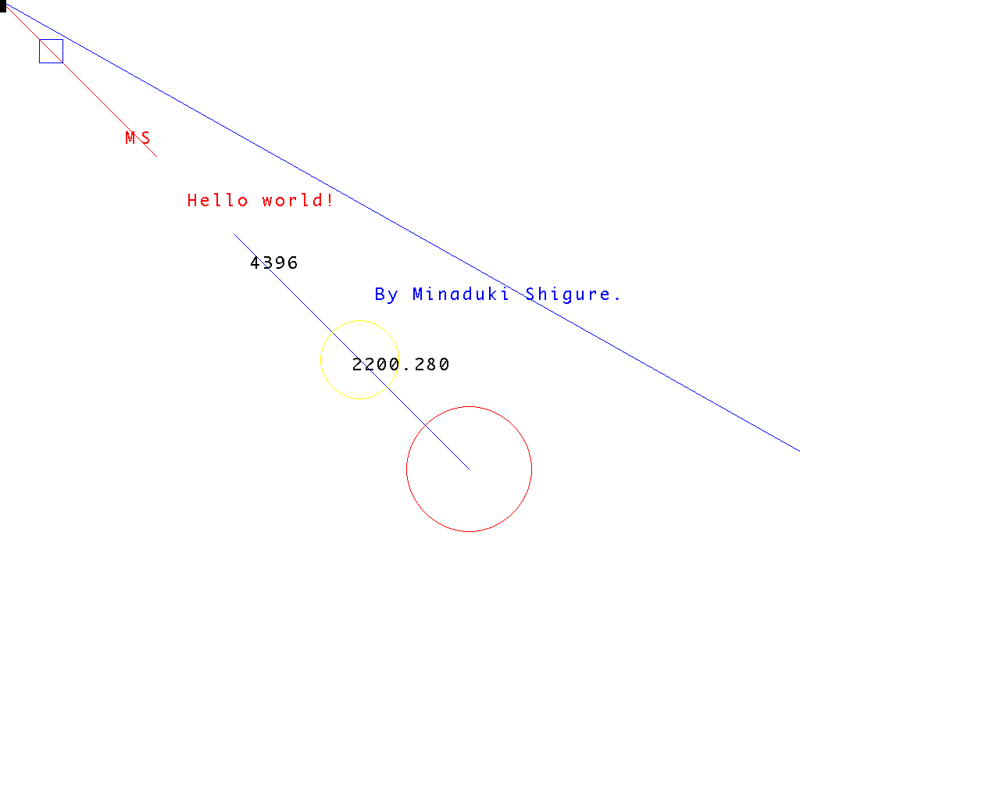

# 数字系统II 实验 报告三
Copyright (c) 2019 Minaduki Shigure.  
南京大学 电子科学与工程学院 吴康正 171180571  
项目repo地址：https://git.nju.edu.cn/Minaduki/beaglebone_proj

## 实验目的
1. 学习嵌入式Linux操作系统设备驱动的方法。
2. 编写一个I/O接口的驱动模块，并且安装到系统内核中，实现通过syscall访问设备。
3. 提供一个用户空间程序，包装对接口的访问。

## 实验环境
### 1. 硬件环境
实验使用了TI的BeagleBone Black开发板作为实验环境，其参数如下：
* 处理器：基于ARM Cortex-A8架构的TI AM3359 Sitara @ 1GHz
* 内存：板载512MiB DDR3
* 存储：板载4GiB 8-bit eMMC闪存
* 拓展存储：支持micro SD存储卡
* 网络界面：RJ-45接口百兆以太网
* 数字多媒体输出：micro HDMI接口
* 拓展接口：UART、GPIO、SPI、I2C等  

使用的显示器：
* 分辨率：最大1920*1080
* 色彩空间：RGB565

### 2. 软件环境
* 上位机：使用Ubuntu 19.10系统的x86 PC
* Linux源码：[版本4.4.155]("https://git.nju.edu.cn/Minaduki/linux")
* Busybox源码：[版本1.30.1]("https://git.nju.edu.cn/Minaduki/beaglebone_proj/tree/master/busybox-1.30.1")
* 编译器：The GNU Compiler Collection 9.2.1
* bootloader：U-boot
### 3. 网络环境
* 网关：192.168.208.254
* 上位机：192.168.208.35
* 开发板：192.168.208.121

## 实验原理
> 关于实验原理：  
具体的实验原理中，实验指导书有所提及的在这里不再重复叙述。这里仅进行一些补充说明。

### 关于内核模块
内核模块可以减小内核的体积，同时增强内核的拓展性。内核模块在加载时只会被链接到内核，因此不能使用标准glibc库的函数，应该使用内核提供的API，并在编译时提供内核源码。  
内核模块可以用于实现设备驱动的功能。  
内核模块驱动程序与守护进程的区别有以下几点：  
1. 守护进程运行在用户空间，内核模块运行在内核空间。因此内核模块不能直接访问用户空间的指针。
2. 守护进程是后台进程，系统CPU会定期访问进程以检查是否有请求，而内核模块只能被动接受请求。

### 关于设备文件
设备文件使用`mknod`命令创建，通过设备号与内核设备驱动相对应，在对设备文件请求系统调用时，会根据设备文件的设备号去内核寻找注册了该设备号的模块，然后调用其注册的方法进行实际I/O操作。

### 关于LED与GPIO
BeagleBone Black开发板上总共有3个空闲可供使用的LED(还有一个被系统用作状态指示灯了)，这三个LED都位于GPIO1控制器上，分别对应GPIO24-GPIO22的引脚。  
对于GPIO控制器，其拥有数个寄存器，其中与本次实验相关的寄存器为`GPIO_OE`与`GPIO_DATAOUT`，每个寄存器大小为4byte，对应每个GPIO控制器控制的32个引脚，其中`GPIO_OE`负责输出使能，0为输出，1为输入，而`GPIO_DATAOUT`对应每个引脚具体的输出状态。实际使用中，只需要将对应的寄存器地址使用ioremap映射到内存中然后就可以进行存取。

## 实验流程
### 1. 准备工作
#### 1.1 重新配置编译内核
使用`make menuconfig ARCH=arm`对内核进行自定义，需要保证如下条件满足：  
`Enable loadable module support`处于启用状态，支持在系统运行时加载/卸载驱动模块。

如有配置修改，配置完成后重新编译内核。

至此，所有准备工作完成，使用内核和根文件系统启动。

### 2. 确定项目结构
项目由三部分组成，分别为：
1. 内核模块文件`led.c`和`led.h`，编译后生成内核目标文件，提供syscall供用户程序调用。
2. 脚本文件`led.sh`，负责在开发板上安装内核模块，并且创建设备文件。
3. 用户程序`ledctrl.c`，通过syscall调用内核模块驱动，提供直观的LED驱动控制。

项目通过Makefile进行管理，将`LCDC.c`和`mydraw.c`文件编译为`libgraphics.so`的动态链接库，同时提供`LCDC.h`和`mydraw.h`用于应用开发。
文件 | 属于 | 依赖于 | 是否提供给用户
:- | :-: | :-: | -:
LCDC.h | 系统交互 | 无 | 是
LCDC.c | 系统交互 | LCDC.h | 否
FONT.H | 绘图库 | 无 | 否
mydraw.h | 绘图库 | LCDC.h FONT.H | 是
mydraw.c | 绘图库 | mydraw.h LCDC.o | 否
libgraphics.so | 二进制库文件 | mydraw.o LCDC.o | 是
main.c | 用户程序 | LCDC.h mydraw.h libgraphics.so | N/A

### 3. 编写程序
> 仅包含部分关键代码，完整源码请[查看此处](https://git.nju.edu.cn/Minaduki/beaglebone_proj/tree/master/LCDC "Powered by NJU Git")。

#### 3.1 底层交互部分
1. `fb_open`函数  
> 函数支持在支持的范围内指定分辨率，通过`fb_open(1, xres, yres)`的方式调用。
  
函数通过syscall对设备文件`/dev/fb0`进行操作。  
使用`open`函数打开设备文件：
```
fd = open("/dev/fb0", O_RDWR);
```
使用`ioctl`函数，获取fb_var_screeninfo的信息，此信息包含屏幕分辨率和每个像素占存储的大小，用于下文mmap大小的确定。
```
if (ioctl(fd, FBIOGET_VSCREENINFO, &vinfo) < 0)
{
    perror("ioctl");
    return VINFO_READ_FAILED;
}
```
如果指定了分辨率，也使用`ioctl`将新的分辨率写回设备：
```
if (costumize)
{
    vinfo.xres = xres;
    vinfo.yres = yres;

    vinfo.xres_virtual = xres;
    vinfo.yres_virtual = yres;

    ioctl(fd, FBIOPUT_VSCREENINFO, &vinfo);
    ioctl(fd, FBIOGET_VSCREENINFO, &vinfo);
}
```
最后，根据获得的信息计算出需要映射的内存大小，使用`mmap`函数完成映射。
```
screen_size = vinfo.xres_virtual * vinfo.yres_virtual * vinfo.bits_per_pixel / 8;
fbp = (unsigned char*)mmap(0, screen_size, PROT_READ | PROT_WRITE, MAP_SHARED, fd, 0);
```
2. 画点函数  

程序提供了两种画点函数可供调用，可以分别指定RGB的8位数值，然后转换成RGB565的格式，或者直接给定一个16位的RGB565颜色，进行绘制：
```
int fb_draw_back_888(int x, int y, char Red, char Green, char Blue)
{
    long offset;
    short color;
    offset = (y * vinfo.xres + x) * vinfo.bits_per_pixel / 8;
    color = ((Red << 8) & 0xF800) | ((Green << 3) & 0x07E0) | ((Blue >> 3) & 0x1F);
    *(unsigned char*)(fbp + offset + 0) = color & 0xFF;
    *(unsigned char*)(fbp + offset + 1) = (color >> 8) & 0xFF;
    return EXIT_SUCCESS;
}

int fb_draw_back_565(int x, int y, u_int16_t color)
{
    long offset;
    offset = (y * vinfo.xres + x) * vinfo.bits_per_pixel / 8;
    *(unsigned char*)(fbp + offset + 0) = color & 0xFF;
    *(unsigned char*)(fbp + offset + 1) = (color >> 8) & 0xFF;
    return EXIT_SUCCESS;
}
```
> `fbp`指针的偏移量与其类型有关，如果变量为uint16_t类型，就需要更改除8为除16。

> 程序中使用以下全局变量：  
```
static int fd;  
struct fb_var_screeninfo vinfo;
static char* fbp;
unsigned long screen_size;
```
> 这些变量封装于LCDC程序内，仅对此程序可见，除`fb_var_screeninfo`外，不建议于绘图库和用户程序内访问。

#### 3.2 绘图库部分
绘图库提供以下绘图函数：
```
//m^n函数
//返回值:m^n次方.
long Pow(int m, int n);

void Clear(u_int16_t color);
void DrawPoint(int x, int y, u_int16_t color);
void DrawLine(int x1, int y1, int x2, int y2, u_int16_t color);
void DrawRectangle(int x1, int y1, int x2, int y2, u_int16_t color);
void DrawCircle(int x0, int y0, int r, u_int16_t color);

//在指定位置显示一个字符
//x,y:起始坐标
//num:要显示的字符:" "--->"~"
//size:字体大小 12/16/24/32
void ShowChar(int x, int y, char content, int size, u_int16_t color);
//显示数字,高位为0,则不显示
//x,y :起点坐标	 
//len :数字的位数
//size:字体大小
//color:颜色 
//num:数值(0~4294967295);	
void ShowNum(int x, int y, long num, u_int8_t len, int size, u_int16_t color);
void ShowFloat(int x, int y, double num, u_int8_t precision, u_int8_t len, u_int8_t size, u_int16_t color);
//显示字符串
//x,y:起点坐标
//width,height:区域大小  
//size:字体大小
//*p:字符串起始地址	
void ShowString(int x, int y, int width, int height, u_int8_t size, char *p, u_int16_t color);
```
并提供部分颜色的16位RGB565值的宏定义，可以直接使用。  
所有的绘图函数同时提供函数名以RGB为结尾的函数，功能相同，但是使用三个8位变量指定三种颜色比例，如：
```
void DrawPoint_RGB(int x, int y, char red, char green, char blue);
```
> 画圆函数使用Bresenham算法实现：
```
void DrawCircle(int x0, int y0, int r, u_int16_t color)
{
	int a, b;
	int di;
	a = 0;
    b = r;
	di = 3 - (r << 1);             //判断下个点位置的标志
	while (a <= b)
	{
		DrawPoint(x0 + a, y0 - b, color);             //5
 		DrawPoint(x0 + b, y0 - a, color);             //0           
		DrawPoint(x0 + b, y0 + a, color);             //4               
		DrawPoint(x0 + a, y0 + b, color);             //6 
		DrawPoint(x0 - a, y0 + b, color);             //1       
 		DrawPoint(x0 - b, y0 + a, color);             
		DrawPoint(x0 - a, y0 - b, color);             //2             
  		DrawPoint(x0 - b, y0 - a, color);             //7 	         
		++a;
		//使用Bresenham算法画圆
		if (di < 0)
        {
            di += 4 * a + 6;
        }
		else
		{
			di += 10 + 4 * (a - b);
			--b;
		}
	}
}
```

> 字符显示函数通过读取预设在`FONT.H`内的矩阵对应项目的值，获取点阵信息：
```
void ShowChar(int x, int y, char content, int size, u_int16_t color)
{  							  
    unsigned char temp, t1, t;
	int y0 = y;
	u_int8_t csize = (size / 8 + ((size % 8) ? 1 : 0)) * (size / 2);//得到字体一个字符对应点阵集所占的字节数	
 	content = content - ' ';//得到偏移后的值（ASCII字库是从空格开始取模，所以-' '就是对应字符的字库）
	for (t = 0; t < csize; ++t)
	{   
		if (size == 12)
        {
            temp = asc2_1206[content][t]; 	 	//调用1206字体
        }
        else if ...
		for (t1 = 0; t1 < 8; ++t1)
		{			    
			if (temp & 0x80)
            {
                DrawPoint(x, y, color);
            }
			temp <<= 1;
			++y;
			if (y >= vinfo.yres)
            {
                return;		//超区域了
            }
			if ((y - y0) == size)
			{
				y = y0;
				++x;
				if (x >= vinfo.xres)
                {
                    return;	//超区域了
                }
				break;
			}
		}
	}  	 	  
}
```

#### 3.3 用户程序
用户程序中应当包含`LCDC.h`和`mydraw.h`两个头文件。  
用户应先调用`fb_open()`函数打开Frame Buffer映射并设置分辨率(可选)，然后，用户可以调用绘图库的函数进行绘制，最后调用`fb_close()`函数关闭设备文件。

### 4. 创建动态链接库
使用Makefile对编译过程进行管理：
```
CC = arm-linux-gnueabihf-gcc
CFLAGS = -Wall -g
CPPFLAGS = -fPIC
LFLAGS = -L. -lgraphics
target = main
object = LCDC.o mydraw.o
mainobj = main.o
lib = libgraphics.so

$(target): $(object) $(mainobj)
	$(CC) $(CFLAGS) $(CPPFLAGS) -o $@ $^

install: main.c $(lib) 
	$(CC) $(CFLAGS) -o $(target) $< $(LFLAGS)

$(lib): $(object)
	$(CC) $(CFLAGS) $(CPPFLAGS) -shared -o $@ $^

%.o: %.c
	$(CC) $(CFLAGS) $(CPPFLAGS) -c $<

clean:
	rm -rf $(target) *.o *.so
```
其中，各个目标的作用如下：
* $(target): 用于生成单文件的测试程序，可独立运行
* install: 用于生成依赖于动态链接库的用户程序，需要配合动态链接库才能运行。
* $(lib): 用于打包LCDC和mydraw的目标文件生成动态链接库
* %.o: 用于编译生成目标文件
* clean: 用于清理

将生成的库文件复制到BeagleBone的`/lib`目录下，执行生成的用户程序，即可看见绘图效果。

### 5. 绘图效果
由于虚拟文件系统的作用，可以很方便地通过`/dev/fb0`文件存取Frame Buffer中的图像。  
使用`cat`或`cp`命令即可将`/dev/fb0`中的内容存储到一个普通文件中：
```
# cat /dev/fb0 > /mnt/demo.raw
```
> 这里的raw后缀名只是用于区分，并不是真正的相机raw文件。


同理，如果普通文件存储了一幅Frame Buffer截图，也可以使用同样的方法显示出来：
```
# cat /mnt/demo.raw > /dev/fb0
```
获取图像后，可以在上位机通过`ffmpeg`程序转码为需要的图像封装格式：
```
$ ffmpeg -vcodec rawvideo -f rawvideo -pix_fmt rgb565 -s 1280X1024 -i demo.raw -f image2 -vcodec png out-%d.png
```
运行本项目提供的用户程序demo，屏幕显示的效果如下：  


> 当长时间没有被使用时，LCDC会进入休眠状态，可以通过向Frame Buffer的空白控制字段送一个数据而唤醒，只需输入以下命令：
```
# echo 0 > /sys/class/graphics/fb0/blank
```

## 小结
### 关于分辨率的问题  
根据Frame Buffer的理论结构，修改fb_var_screeninfo中的物理和虚拟分辨率大小就可以更改输出显示的分辨率，但是实际操作中发现，如果在系统启动时连接了显示器，则分辨率最高只能修改到1280\*1024，而如果在系统启动时没有连接显示器，则分辨率最高只能修改到1024\*768。  
如果使用fbset修改分辨率到更高值，程序会正常返回，但是分辨率并不会发生改变，如果使用ioctl函数强行修改了分辨率并尝试进行显示的话，则会报段错误而强制退出。  
因此我认为，分辨率不能修改可能有以下两个原因：  
1. 可能是由于开发板搭载的LCDC本身无法支持更高的分辨率，因此对可供Frame Buffer映射的I/O长度有限制。在I/O重映射时如果强行扩大映射范围，会访问到不属于自己的I/O，导致程序出错。但是这无法解释在开机时连接与不连接显示器时最大分辨率有差别的现象。  
2. 可能是由于内核会在启动时划分内核内存空间的大小，而由于系统本身资源有限，内核更倾向于减少内核内存空间浪费以确保应用能够顺利运行，因此猜想在Frame Buffer在划分时就严格按照其长度分配内存空间，所占用的内存后方的连续空间也被其他需求占用了，因此无法扩大Frame Buffer的大小，也不能向后越界访问。这可以解释在不同的情况下启动时的分辨率差异问题，因为理论来说，系统内核应该可以控制LCDC识别显示设备的规格，也可以部分解释fbset无功而返的原因，但是依然缺乏足够的说服力。

### 关于封装
在编写绘图库时，使用了来自`LCDC.c`程序中的一个外部变量，用于确定绘图边界，这样的做法对封装有一定损伤。  
一个想到的替代方案时，修改底层交互程序的`fb_open()`函数，新增加一个参数用于回传一个结构体，包含绘图需要的参数，在绘图库中设置一个初始化函数，初始化这样一个结构体，并且调用`fb_open()`函数配置Frame Buffer并获得需要的参数。  
最后，将绘图库中的这个初始化函数提供给用户程序实现初始化，用以取代在用户空间访问`fb_open()`函数实现的功能，这样用户程序只需包含`mydraw.h`头文件，底层操作的两个文件对于用户完全透明。